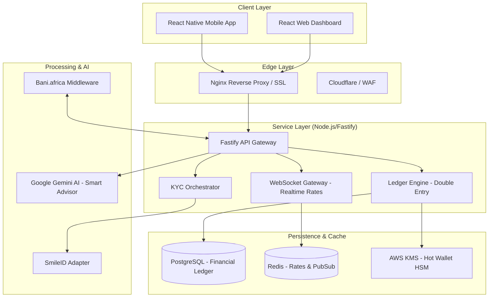

# KlasWallet Architecture Diagram

## Component Description

1.  **Mobile App & Admin Dashboard**: User interfaces for personal asset management and merchant operations.
2.  **Nginx**: Handles SSL termination and routes traffic. Ensures secure WebSocket upgrades for real-time rates.
3.  **Fastify API**: High-performance backend handling Auth, Transfers, and Exchange logic.
4.  **Ledger Engine**: The heart of the system. Implements strict double-entry accounting to ensure no currency is created out of thin air.
5.  **Bani.africa Adapter**: Abstracts complex crypto-fiat settlement logic. Handles webhooks for deposits and signs outbound disbursements.
6.  **Gemini AI**: Provides the "Smart Advisor" feature, analyzing user history to suggest portfolio optimizations.
7.  **PostgreSQL**: Stores persistent financial data with strict ACID compliance.
8.  **Redis**: Caches volatile data like exchange rates and manages real-time broadcast via WebSockets.
9.  **AWS KMS**: Hardware-level security for signing transactions. Private keys never leave the HSM.